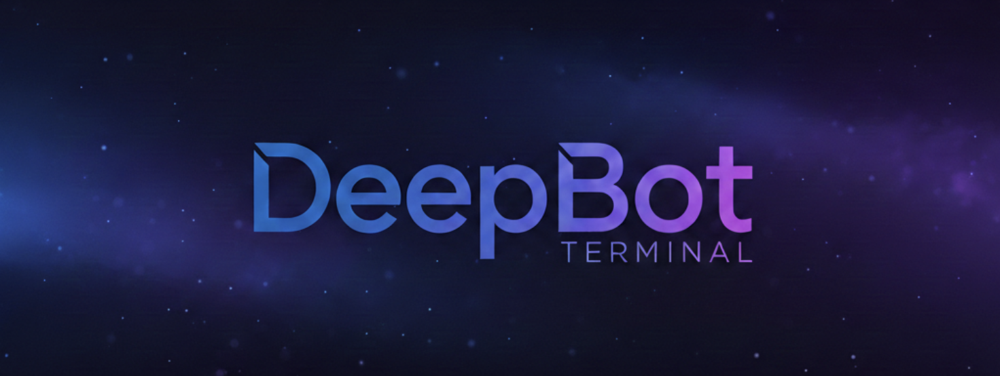

<div align="center">



**🤖 通用桌面 AI 助手 | 智能、安全、可扩展**

[](https://opensource.org/licenses/MIT)
[](https://nodejs.org/)
[](https://www.typescriptlang.org/)
[](https://www.electronjs.org/)

[English](README_EN.md) | [简体中文](README.md)

</div>

---

## 📖 简介

DeepBot Terminal 是由格灵深瞳灵感实验室成员开发的桌面 AI 助手，它就像为你的电脑装上了一个智能大脑。无论是整理文件、定时提醒、网页自动化，还是复杂的多步骤任务，DeepBot 都能通过 AI Agent 技术帮你轻松搞定。它支持多任务并行处理、定时任务、技能扩展等功能，同时通过严格的安全机制保护你的系统安全。

### ✨ 核心特性

- 🎯 **多任务并行处理** - 同时处理多个任务，互不干扰
- 🔧 **10 个内置工具** - 文件操作、命令执行、浏览器控制、图片生成等
- 🧠 **记忆系统** - 长期记忆用户偏好和重要信息
- ⏰ **定时任务** - 自动化执行周期性任务
- 🎨 **技能扩展** - 通过 Skills 组合工具实现复杂功能
- 🔒 **安全限制** - 严格的路径白名单机制，保护系统安全
- 🤖 **多模型支持** - 通义千问、OpenAI、Claude 等
- 🌐 **未来可扩展** - 支持接入飞书、Discord、Slack 等平台

---

## 🚀 快速开始

### 环境要求

- **Node.js**: 20.0.0 或更高版本
- **pnpm**: 10.23.0 或更高版本
- **操作系统**: macOS、Windows、Linux

### 安装

```bash
# 克隆仓库
git clone https://github.com/yourusername/deepbot.git
cd deepbot

# 安装依赖
pnpm install

# 开发模式运行
pnpm run dev
```

### 构建

```bash
# 构建所有平台
pnpm run dist

# 仅构建 macOS
pnpm run dist:mac

# 仅构建 Windows
pnpm run dist:win

# 仅构建 Linux
pnpm run dist:linux
```

---

## 🏗️ 架构设计

DeepBot 采用模块化架构，主要包含以下层次：

```
┌─────────────────────────────────────────┐
│         用户界面 (Electron)              │
│    未来可扩展：飞书/Discord/Slack        │
└─────────────────┬───────────────────────┘
                  │ IPC
┌─────────────────▼───────────────────────┐
│         Gateway (会话管理)               │
│    • Tab 管理 (最多 10 个)               │
│    • 消息队列                            │
└─────────────────┬───────────────────────┘
                  │
┌─────────────────▼───────────────────────┐
│      Agent Runtime (每个 Tab 一个)       │
│    • 智能决策和工具编排                  │
│    • 自动继续机制 (最多 100 次)          │
│    • 操作追踪 (防重复，最多 3 次)        │
└─────────────────┬───────────────────────┘
                  │
┌─────────────────▼───────────────────────┐
│         10 个工具 + 安全检查             │
│    🔒 路径白名单 • 工作空间隔离          │
└─────────────────┬───────────────────────┘
                  │
        ┌─────────┼─────────┐
        ▼         ▼         ▼
    Skills   定时任务   数据存储
```

### 架构说明

- **Gateway**: 管理所有会话，每个 Tab 对应一个独立会话
- **Agent Runtime**: 基于 `@mariozechner/pi-agent-core`，负责智能决策和工具编排
- **Tools**: 10 个内置工具，提供文件、命令、浏览器等核心能力
- **安全检查**: 所有文件和命令操作都经过路径白名单验证

---

## 🔧 10 个内置工具

| 工具 | 功能 | 典型用途 |
|------|------|---------|
| **File Tool** | 文件读写操作 | 读取配置、保存数据、搜索文件 |
| **Exec Tool** | 执行命令行命令 | 运行脚本、系统操作、安装软件 |
| **Browser Tool** | 浏览器控制 | 网页截图、自动化操作、内容提取 |
| **Calendar Tool** | 日历管理 | 查看日期、计算时间、日程提醒 |
| **Environment Check** | 环境检查 | 检测系统信息、验证依赖、诊断问题 |
| **Image Generation** | AI 图片生成 | 创建图片、设计素材、视觉内容 |
| **Web Search** | 网页搜索 | 实时信息查询、资料搜集、内容研究 |
| **Memory Tool** | 记忆管理 | 存储用户偏好、读取历史信息 |
| **Skill Manager** | 技能管理 | 安装/卸载/列出技能包 |
| **Scheduled Task** | 定时任务 | 创建/管理/执行定时任务 |

---

## 🔒 安全机制

DeepBot 实现了严格的安全限制，确保 AI Agent 只能访问用户明确授权的目录：

### 路径白名单

只允许访问以下配置的目录及其子目录：

| 目录类型 | 默认路径 | 用途 | 可配置 |
|---------|---------|------|--------|
| **工作目录** | `~` (用户主目录) | 文件读写、命令执行 | ✅ |
| **脚本目录** | `~/.deepbot/scripts` | Python 脚本存储 | ✅ |
| **Skill 目录** | `~/.deepbot/skills` | Skill 包安装 | ✅ |
| **图片目录** | `~/.deepbot/generated-images` | AI 生成图片保存 | ✅ |

### 安全检查流程

```
工具调用 → 路径安全检查 → 在白名单内？
                           ├─ 是 → 允许执行
                           └─ 否 → 拒绝执行，返回错误
```

---

## 🧠 记忆系统

DeepBot 支持长期记忆功能，可以记住用户的偏好和重要信息：

- **存储位置**: `~/.deepbot/memory/MEMORY.md`
- **格式**: Markdown 格式，结构化存储
- **自动注入**: 每次对话自动加载到系统提示词
- **实时更新**: 记忆更新后自动重载所有 Agent

### 使用示例

```
用户: "记住：我喜欢简洁的代码"
DeepBot: "已记住你的偏好"

用户: "我的偏好是什么？"
DeepBot: "你喜欢简洁的代码..."
```

---

## ⏰ 定时任务

支持创建和管理定时任务，自动化执行周期性工作：

### 功能特性

- ✅ Cron 表达式支持
- ✅ 专用 Tab 执行（锁定不可关闭）
- ✅ 清空历史上下文
- ✅ 执行历史记录

### 使用示例

```
用户: "每天早上 9 点检查桌面文件"
DeepBot: "已创建定时任务，将在每天 9:00 执行"
```

---

## 🎨 技能扩展 (Skills)

通过 Skills 系统可以组合多个工具实现复杂功能：

### 安装 Skill

```bash
# 在 DeepBot 中使用 Skill Manager 工具
"安装 weather skill"
```

### Skill 目录

- **默认路径**: `~/.deepbot/skills/`
- **自动发现**: 启动时自动加载所有已安装的 Skills
- **动态管理**: 支持运行时安装/卸载

---

## 🤖 支持的 AI 模型

DeepBot 支持多种 AI 模型提供商：

- **通义千问** (阿里云) - 默认模型
- **OpenAI** (GPT-4、GPT-3.5)
- **Claude** (Anthropic)

### 配置 API 密钥

在系统设置中配置对应的 API 密钥即可使用。

---

## 📦 外部服务

DeepBot 集成了以下外部服务：

| 服务 | 用途 | 配置位置 |
|------|------|---------|
| **Tavily API** | 网页搜索 | 系统设置 → Web Search |
| **Gemini** | 图片生成 (Imagen 3) | 系统设置 → Image Generation |

---

## 🛠️ 开发指南

### 项目结构

```
deepbot/
├── src/
│   ├── main/           # 主进程代码
│   │   ├── gateway.ts          # 会话管理
│   │   ├── agent-runtime/      # Agent 运行时
│   │   ├── tools/              # 10 个工具
│   │   ├── scheduled-tasks/    # 定时任务
│   │   └── database/           # 数据存储
│   ├── renderer/       # 渲染进程代码 (React)
│   ├── shared/         # 共享代码
│   └── types/          # 类型定义
├── docs/               # 文档
└── scripts/            # 构建脚本
```

---

## 📝 许可证

本项目采用 [MIT License](LICENSE) 开源协议。

---

## 🙏 致谢

DeepBot 的开发受到以下项目的启发：

- [Clawdbot](https://github.com/openclaw/openclaw) - 导师项目，提供了架构参考
- [@mariozechner/pi-agent-core](https://github.com/badlogic/pi-agent) - AI Agent Runtime
- [Electron](https://www.electronjs.org/) - 跨平台桌面应用框架

---

## 📧 联系方式

- **作者**: Kevin Luo
- **问题反馈**: [GitHub Issues](https://github.com/yourusername/deepbot/issues)

---

<div align="center">

**⭐ 如果这个项目对你有帮助，请给一个 Star！**

Made with ❤️ by Kevin Luo

</div>
